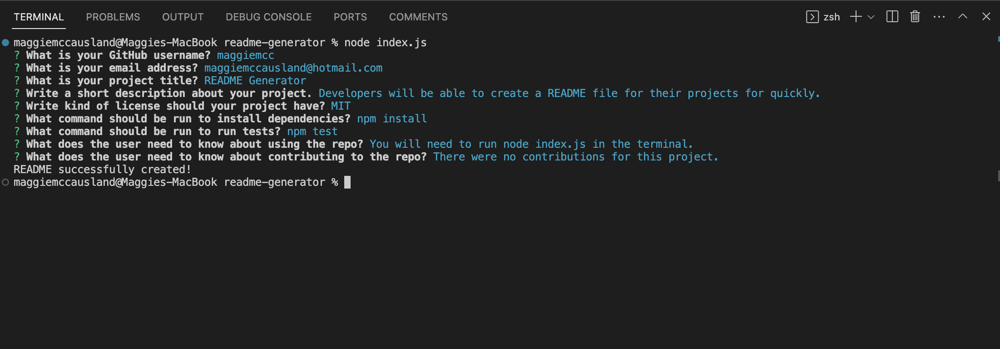

# Professional README Generator
[How to create a Professional README](https://coding-boot-camp.github.io/full-stack/github/professional-readme-guide)

## Table of Contents
- [Description](#description)
- [Link](#link)
- [Installation](#installation)
- [Usage](#usage)
- [Contributing](#contributing)
- [Acceptance Criteria](#acceptance-criteria)

## Description
This project is meant to help developers create a professional README file for their projects more quickly.

## Installation
To install necessary dependencies, run the following command:  
   1. Clone the repo  
    ```git clone git@github.com:your-username/readme-generator.git```
  2. Install and initialize NPM packages  
    ```npm install inquirer@8.2.4```  
    ```npm init -y```

## Usage
   1. Run node
   ```node index.js```
   2. Answer each of the questions in the terminal to have a readme file generated.  
   EX: ```What is your GitHub username?```
   3. You will be able to find your newly created README file under the folder name of "user-readme".

## Contributing
1. Fork the Project
2. Create your Feature Branch  
```git checkout -b feature/featureName```
3. Commit your Changes  
```git commit -m 'Add some featureName'```
4. Push to the Branch  
```git push origin feature/featureName```
5. Open a Pull Request

## Screenshot / Video
Click the image below to watch a walkthrough:  
[](https://watch.screencastify.com/v/wWFU9PLmhhqLwQ0WYrM4)